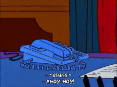

# Ahoyhoy!

## About Me

My name is William (you can call me Will if you like).

I'm a 🛡 security researcher and 📖 PhD student affiliated with the CCSL/CISL labs out of Carleton University in Ottawa, Canada.

As of January 10th, 2021, I will be starting a new software engineering internship role at Isovalent, working on Cilium and eBPF development full time.

Here is a tl;dr for you:
- 🇨🇦 I'm a proud Canadian
- 🦀 I'm also a proud Rustacean
- 🔭 I’m currently working on eBPF applications for runtime security.
- ✨ I’m looking to collaborate on anything related to Rust, Linux, eBPF, or OS security.
- 📫 How to reach me:
  - william <àŧ> williamfindlay.com
  - will <àŧ> ccsl.carleton.ca
  - My PGP public key is [here](https://www.cisl.carleton.ca/~will/keys/email.pub.txt) (expires 04/02/2030)
- 😄 Pronouns: He/Him
- ⚡ Fun fact: My house has about four times as many animals as it has humans.

I have a website where you can find more information: https://www.cisl.carleton.ca/~will/

## My GitHub Awards

